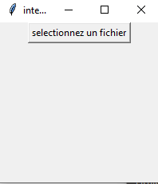
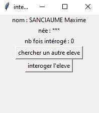

# projetNSIpartie3
**petite précision avant l'explication**

vous avez pu voir mon absence la dernière semaine avant les vacances et soyons honnête , c'est assez embêtant , j'ai pas avancé sur le projet , mais je l'ais testé a fond !

## les explications
quand on lance **main.py** (avec thonny ou IDLE bien sur) on tombe sur une fenêtre comme ca

il suffit de cliquer sur le bouton et de sélectionner le **.csv** qui représente la classe

l'interface évolue alors !!

maintenant 2 boutons s'affiche
* le bouton **chercher un autre élève**
* le bouton **interroger l'élève**

### chercher un autre élève
ce bouton a une utilité , et vous l'avez deviné c'est d'interroger un nouvel élève !

### interroger l'élève
ce bouton sert a interrogé un élève , alors le nombre de fois où il a été interrogé seras enregistré

## si vous vous intéressez au code
voici 2/3 explication sur mon code pour vous simplifier la vie

**avant de commencer !**

je sais que faire des global c'est horrible , mais pour le bien être du code et de mon cerveau , j'ai préféré en mettre , même si j'ai essayé de les minimiser

# Le projet

la partie 3 est composé de 5 fichier

* main.py
* interogageSystem.py
* miscellaneous.py
* pointSystem.py
* saveSystem.py

voici leurs utilité !

### main
le fichier main et le fichier qui s'exécute une fois lancé,
elle permet la création de la fenêtre et le chargement du csv sélectionné

une fois le fichier chargé , elle va exécuter une fonction contenue dans **interogageSystem.py**

### interogageSystem
ce fichier va contenir tout ce qu'il faut pour faire fonctionner le programme , même si elle va utiliser comme aide les autre fichier **.py** (expliqué ci dessous)

### miscellaneous
ce fichier contient certaine fonction utile au programme

#### choiceDict
qui permet de choisir un élève au hasard dans un dictionnaire (malgrès le faite que ce soit un objet non indexable)

#### secureInput
pas très utile ici mais qui permet de faire un Input avec une question fermé

### pointSystem
ce fichier va permettre de s'occuper du nombre de fois qu'un élève est interrogé

#### addPoint
qui va permettre d'ajouter un point à un élève

#### getData
permet d'obtenir le nombre de fois qu'un eleve est interogé (si l'eleve n'a jamais été intérogé , alors le programme renvoie 0 (logique)

### saveSystem
continents ce qu'il faut pour save

#### save_name
constante qui contient le nom du fichier qui contient les infos sur le nombre de fois interrogé

#### loadData
revoie les données comportant le nombre de fois où chaque eleve a été interogé

#### saveData
permet de sauvegarder les données dans un fichier

